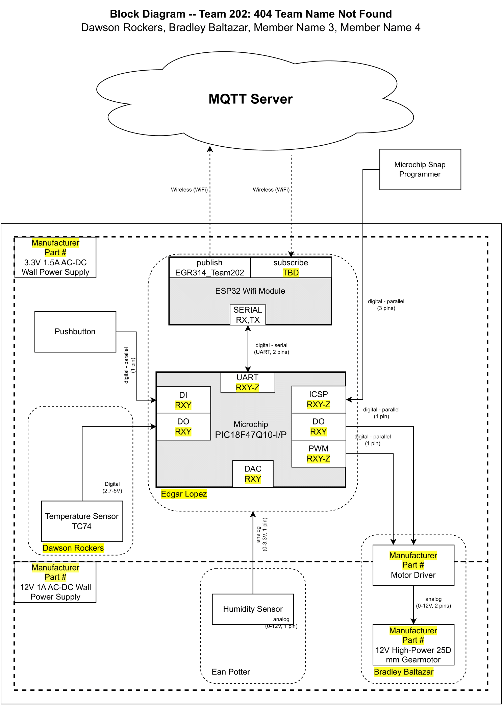

# Team's Block Diagram

The block diagram consists of:
 
1. One TC74 Temperature Sensor
   - This temperature sensor can accurately read the temperature from about -40°F to 257°F
   - This sensor is powered by 3.3V

2. One Humidity Sensor
   - This humidity sensor can read relative humidity as a percentage
   - The sensor has an accuracy of +- 4.5%
  
3. One High Powered 12v Motor
   - This motor will be used to present the canopy and retract based off temperature and humidity values
   - Motor itself will receive power from the 12 volt rail as the motor driver will recieve 3.3V
  
4. The entire system is programmed through a PIC18F47Q10 Microchip along with an ESP32 WiFi Module
   - EDGAR FILL IN HERE
   - AND HERE YOU WILL PROBABLY NEED
  
### The Current Block Diagram:
 

