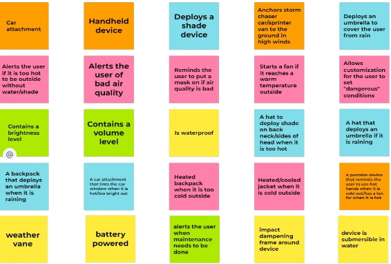

# Design Ideation
Below you can see our brainstorming process to choose a design. You may notice the final design being none of the following selected designs. This is because, as a group, we agreed the previous selected design would not be feasible for the time we had. With more time, we would have liked to fulfil the requirements for this selected design.

## Final Picks

We devised three designs were our final choices using the brainstormed ideas listed below.

 

## Design Ideas 

As a group, we came up with 95 different ideas, features, and add-ons for a possible project design. 
 

 

[Back to Home Page](/index.md)
