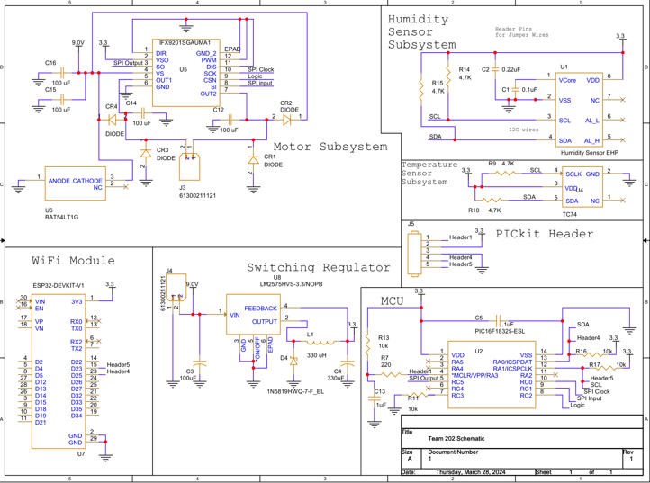
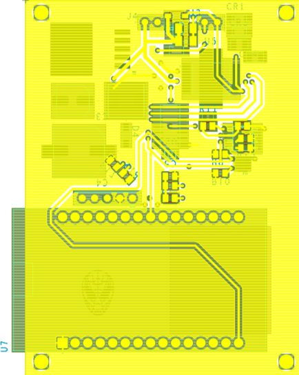
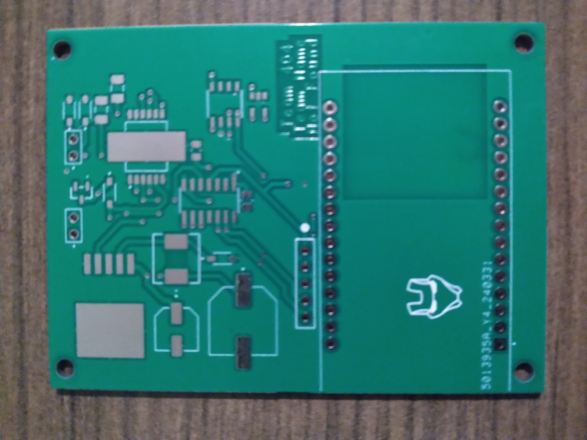
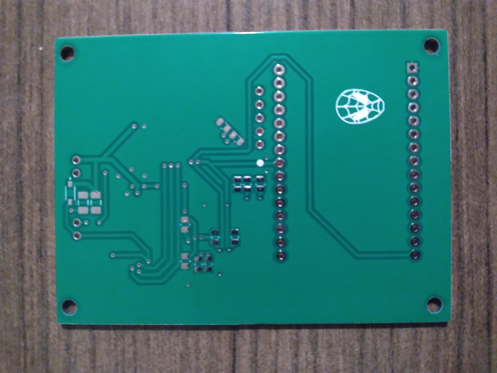

# Hardware Implementation
## Schematic

## Functionality Towards the User's Needs
Our Schematic shows our different subsystems and the connections required to make them function. Our power regulator has been designed to receive a voltage of 9 Volts from a 9 volt battery and transform it into 3.3 Volts before distributing that voltage to the motor driver, microcontroller, temperature sensor, and humidity sensor. The motor driver is designed to receive both regulated and unregulated power so that it can apply unregulated power to the motor according to commands received from the microcontroller. The microcontroller in turn is able to receive data collected from both sensors. The sensors recieve 3.3V each and communicate with the PIC. Through this communication, the PIC is able to assess the state of the motor and change that state based on the values given from the sensors.

The first subsystems, the Voltage Regulator, Microcontroller, and ESP32 are all designed to work with eachother in order to aid the user in reading the gathered values. The voltage regulator recieves 9 volts and turns it into 3.3 volts for all of the logic level parts. The Microcontroller recieves data from the I2C sensors and sends that data to the ESP32 through USART communication over WiFi. The user is able to read these values using an MQTT server that the ESP32 is connected to. Depending on the recieved values, the Microcontroller then turns on or off the motor.  

The second subsystem, the Humidity Sensor, uses the I2C protocol to communicate with the pic. This subsystem is an important part to ensure the comfort of the user. 

The next subsystem, the Temperature Sensor, also employs the I2C protocol for communication. Another crucial variable for weather monitoring is ambient temperature, which is sensed by the TC74 temperature sensor. Similar to the first subsystem, this subsystem satisfies the product’s needs and requirements by sending the recieved temperature to the PIC.

A motor and motor controller that communicate using an SPI-based interface make up the fourth subsystem. The motor is managed by the IFX9201SGAUMA1 motor controller. The product requirement that a subsystem have at least one motor controlled by a motor controller communicating via an SPI-based protocol is met by this subsystem.

## PCB

## What If: Version 2.0
If we were to make a second version, the team would start with a new Microcontroller. The team currently uses a 14 pin PIC which makes it difficult to work with. The team was forced to branch both sensors along with the programing headers all from one pin on the PIC. The PIC also offered very little versitility which caused some issues. 

Next, the team would add plenty of debugging LEDs to help with the debugging process. There are currently no debugging LEDs on the team's schematic and board. This made it difficult to assess the issues with the team board when programming. 

Lastly, the team wants to impliment header pins at each unused GPIO pin in the event of needing to add additional components to the board. The header pins would allow the team to add components with ease rather than needing to damage the board in some way.

[Back to Home Page](/index.md)
