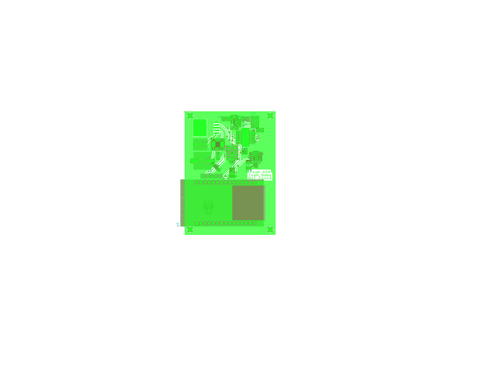

# Hardware Implementation
## Schematic

Our Schematic shows our different subsystems and the connections required to make them function. OOur power regulator has been designed to receive a voltage of around 9 Volts and transform it into 3.3 Volts before distributing that voltage to the motor driver, microcontroller, temperature sensor, and humidity sensor. The motor driver is designed to receive both regulated and unregulated power so that it can apply unregulated power to the motor according to commands received from the microcontroller. The microcontroller in turn is able to receive data collected from both sensors. 

## PCB

