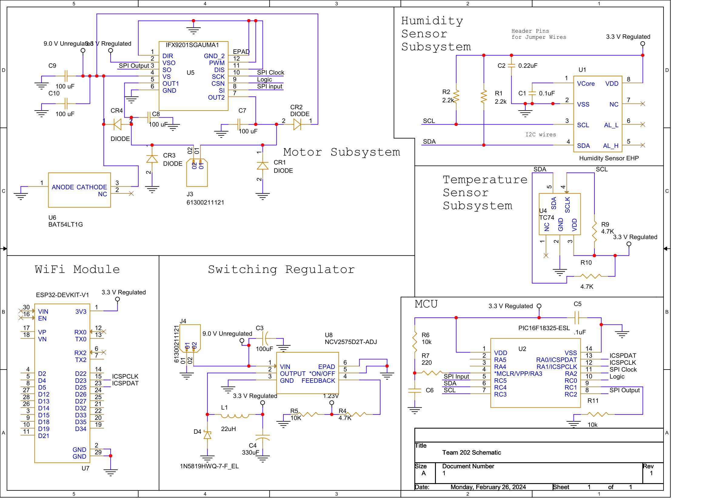

# Hardware

<table>
<tr><th>Logic Level Parts</th><th>Additional Parts</th></tr>
  
<tr><td>

| Product |Part Number|
|  --- |  --- |
|Temperature Sensor|TC74A0-3.3VCTTR|
|Microchip|PIC16F18325-ESL|
|WiFi Module|ESP32-DEVKIT-V1|
|Switching Regulator|NCV2575D2T-ADJ|
|Motor Driver|IFX9201SGAUMA1|
|Humidity Sensor|480-5704-1-ND|

</td><td>

| Product (Part Number) | Value | Quantity |
|  ---   | --- | --- |
| Non-Polarized Capacitor (EDK107M035S9HAA) |100uF|4|
| Non-Polarized Capacitor (718-2502-1-ND) |.22uF|1|
| Non-Polarized Capacitor (PCF1126CT-ND) |.1uF|3|
| Polarized Capacitor (EDK107M035S9HAA) |100uF|1|
| Polarized Capacitor (EDK337M025A9PAA) |330uF|1|
| Resistor (RMCF0805JT10K0) |10k Ohm|3|
| Resistor (RMCF0805JT4K70) |4.7k Ohm|3|
| Resistor (541-2841-1-ND) |2.2k Ohm|2|
| Inductor (IHLP2525CZER220M11) |22uH|1|

</td></tr> </table>

## Complete Schematic

