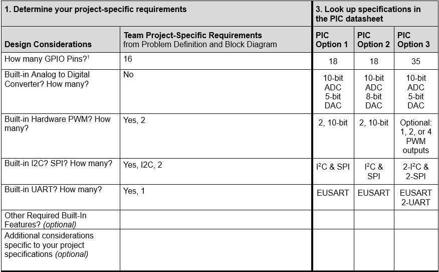
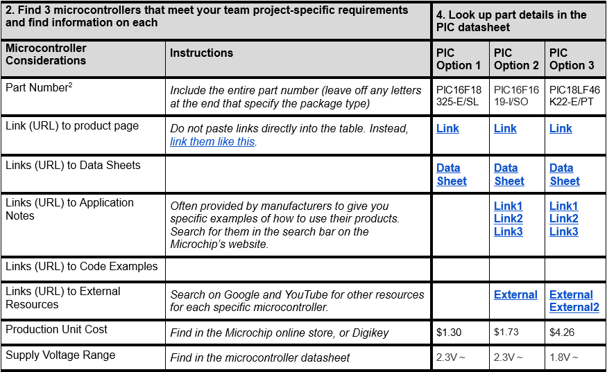
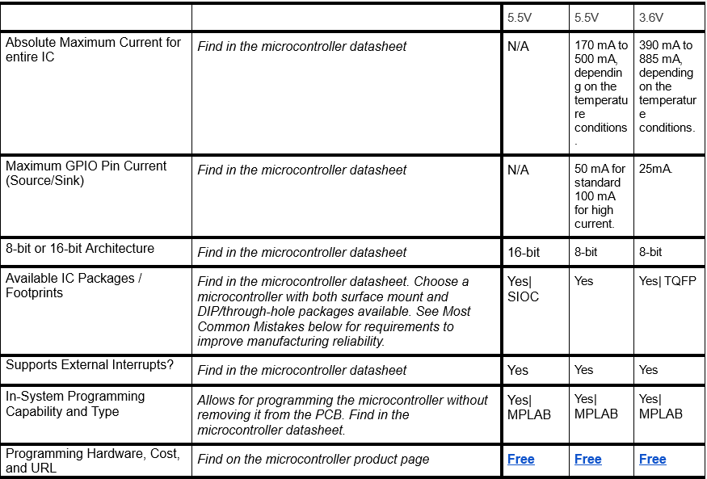
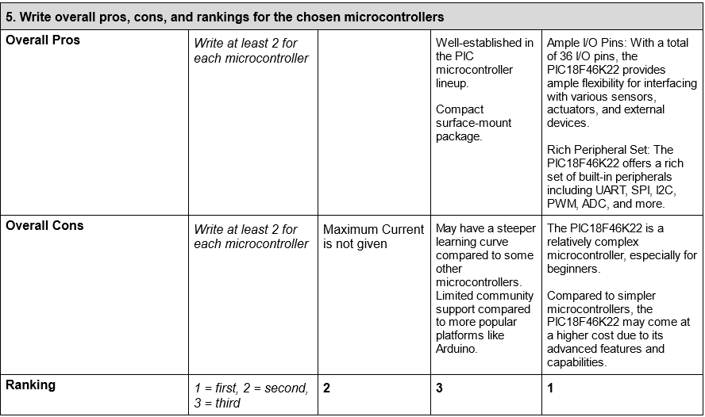

# Microcontroller Selection Process
Here's the systematic process our team followed to select the microcontroller for our product. We initiated by establishing requirements that aligned with both our needs and the project specifications. After defining these criteria, we deliberated and identified our top three choices. Subsequently, we conducted a comprehensive analysis of each microcontroller's features, using their capabilities as the basis for our ranking

 

## Microcontroller Requirements

 

## Top Choices

 

## Each Microcontroller's Features

## Microcontroller Rankings

## Final Choice and Rationale

After careful consideration, we opted for the PIC16F18325-E/SL microcontroller. Boasting ample GPIO pins and versatile programming support, it perfectly aligns with our project needs. Its efficient low-power design is particularly advantageous for our battery-powered application.

[Back to Home Page](/index.md)
