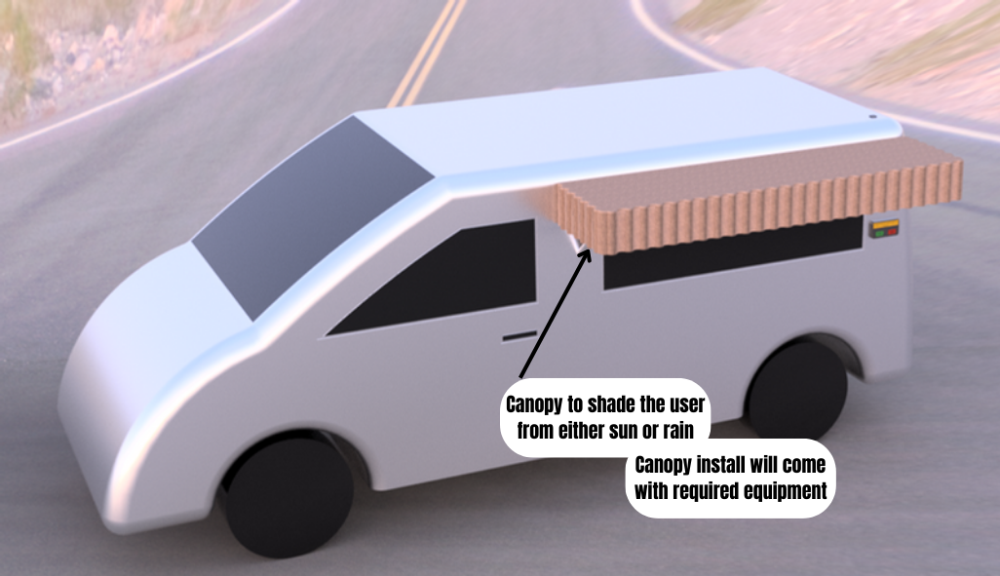
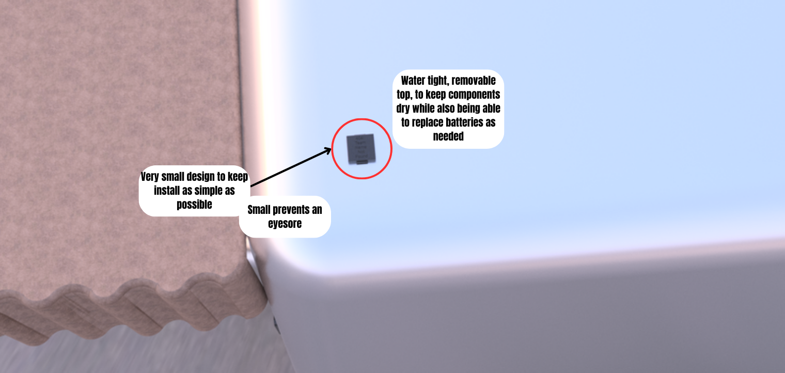

# Selected Design
The design the team decided on was a compact, user-friendly temperature and humidity sensor designed for seamless integration onto mobile homes, campers, or sprinter-styled vans. This innovative device features an intuitive LCD screen interface that prompts users with the option to deploy a canopy based on the prevailing outdoor temperature or humidity levels. While users retain full control over canopy deployment, the sensor serves as a proactive safeguard against the elements, empowering travelers to make informed decisions about their outdoor comfort and protection.

## Canopy and Overall Design

## Temperature and Humidity Sensor Housing

## LCD Screen

