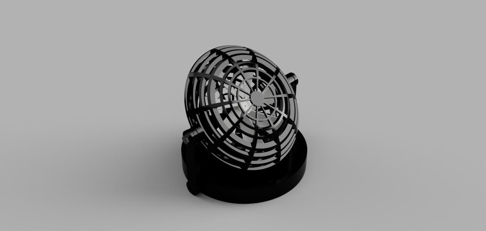
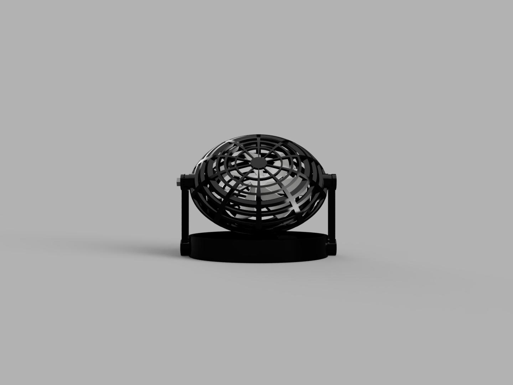

# Selected Design
The selected design is a temperature and humidity controlled fan. The idea for the fan is to automatically turn on when the temperature or humidity gets too high. The fan would require no human interaction other than to switch on and off when not in use. The base will have a system of magnets to allow the user to prop it up on their RV, metal shed, or mobile home. The fan also allows 90° of rotation which allows the user to change the angle at which the fan will blow on them. This fulfills the users' needs of freedom of use, and easy setup. The fan requires no tools to assemble and can be used directly out of the box. 
## Fan Design

## 45° Angle

