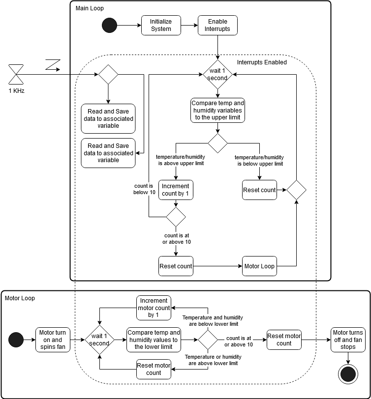
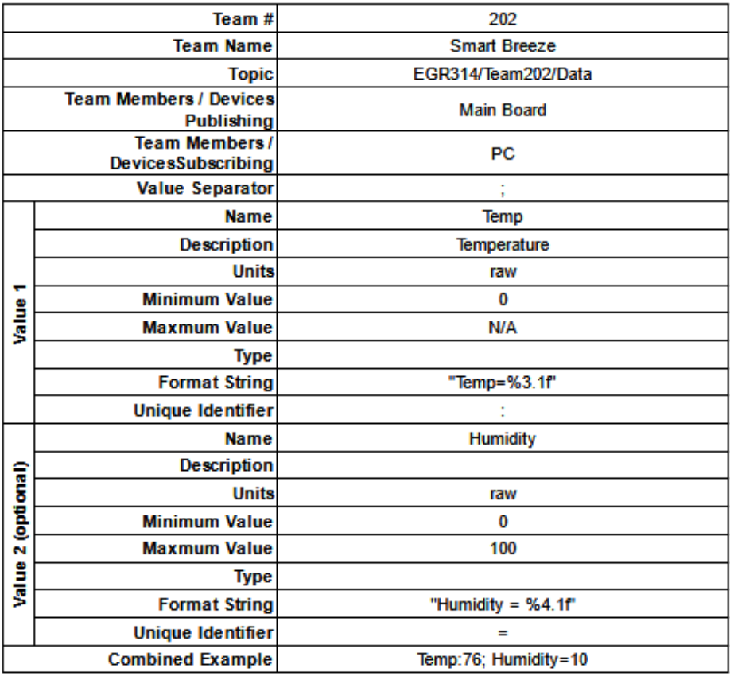

# Software Implementation

## UML Diagram


&nbsp;&nbsp;&nbsp;&nbsp;&nbsp;&nbsp;This Software is designed to instruct the device in how to interact with the environment according to data received from the sensors. The device is constantly updating sensor values through use of a timer based interrupt, which triggers the microchip to read the data being sent and update the variables in the code. If either of the two variables remain above a predetermined value for too long, the code will turn on the fan and switch modes, aiming to cool the user down while a high temperature or humidity has been detected. This alternate mode will detect whether both variables are both a certain value at the same time, and if they remain like this for long enough, the fan will turn back off.

&nbsp;&nbsp;&nbsp;&nbsp;&nbsp;&nbsp;Our design process was hindered many times by many factors, and thus the code has evolved and changed many times. Here is a list of the largest changes.
1. The code was reprogrammed for a different microchip due to issues with our first one
2. The speed at which the timer interrupt triggered was decreased to allow for more stable fan updates
3. Data from the Humidity Sensor needed to be requested before it could be sent
4. Code from individual subsystems was combined to make one cohesive whole
5. The code needed to be redone several times for testing purposes

## Topic Table


## MPLABX Code 
```
#include "mcc_generated_files/mcc.h"
#include "mcc_generated_files/i2c1_master.h"
#include "mcc_generated_files/examples/i2c1_master_example.h"
#include <string.h>
#include <stdbool.h>
#include <stdint.h>
#include <stdio.h>

//Define Constants
#define PERIOD 0x80
#define ZERO 0x00
#define HUpperLimit 50
#define HLowerLimit 40
#define TUpperLimit 80
#define TLowerLimit 76
#define HUMIDCONVERTFACTOR 100
#define TemperatureAddress 0x4C
#define TemperatureRawData 0x00

//Motor Driver Variables
uint8_t FORWARD = 0b11101111;
uint8_t BACK = 0b11101101;
uint8_t STOP = 0b11101000;
uint8_t ALV;
uint8_t PTM;
uint8_t CTM; 

//Temp Sensor Variables
#define TEMP_ADDR 0x4C
#define TEMP_REG 0x0
uint8_t temp_value = 0x0;

//Hum Sensor Variables
#define HUM_ADDR 0x27
#define HUM_REG 0x00
uint8_t hum_value = 0x0;

//Timer Callback Function
void timer_callback(void){
    TemperatureGet();
    HumidityGet();  
    printf('Temp:3.1f; Humidity=4.1f\r\n',temp_value,hum_value);
}

//Temperature Sensor Function
void TemperatureGet(void){
    uint8_t TempRaw;
    TempRaw = I2C2_Read1ByteRegister(TemperatureAddress, TemperatureRawData); //Read Temp
    Temp = ((TempRaw*1.8) + 32); //Convert to F
}

//Humidity Sensor Function
void HumidityGet(void){
    uint8_t dbuff[4];
    uint16_t conversion;
    I2C2_ReadNBytes(0x27, dbuff, 1); //Read Humidity        
    __delay_ms(38);
    I2C2_ReadNBytes(0x27, dbuff, 4);
    conversion = (dbuff[0] << 8 | dbuff[1]) & 0x3fff; //Convert Humidity
    HumidPercent = (((float)conversion / (16382)) * HUMIDCONVERTFACTOR); //Convert To Percentage    
}

/*
                         Main application
 */
int main(void)
{
    // Initialize the device
    SYSTEM_Initialize();
    SPI1_Open(SPI1_DEFAULT);
    I2C2_Initialize();
    TMR2_Initialize();
    EUSART1_Initialize();
    TMR2_SetInterruptHandler(timer_callback);
    
    INTERRUPT_GlobalInterruptEnable();
    INTERRUPT_PeripheralInterruptEnable();
    
    mode = 0;
    count = 0;
    TMR2_StartTimer();
    while(1){
        while (mode = 0){
            if (HumidPercent > HUpperLimit || Temp >= TUpperLimit){
                count = count + 1;
            }else{
                count = 0;
            }
            if (count >= 10){
                ChipSelect_SetLow();
                PTM = SPI2_ExchangeByte(FORWARD);
                ChipSelect_SetHigh();
                __delay_ms(10000);
                
                ChipSelect_SetLow();
                ALV = SPI2_ExchangeByte(BACK);
                ChipSelect_SetHigh();
                __delay_ms(1000);
                mode = 1;
                count = 0;
            }
            __delay_ms(1000);
        }
        while (mode = 1){
            if (HumidPercent < HLowerLimit && Temp < TLowerLimit){
                count = count + 1;
            }else{
                count = 0;
            }
            if (count >= 10){
                ChipSelect_SetLow();
                CTM = SPI2_ExchangeByte(STOP);
                ChipSelect_SetHigh();
                printf("Stop Pressed Data: %x\n\r", CTM);
                __delay_ms(2000);
                mode = 0;
                count = 0;
            }
            __delay_ms(1000);
        }
    }
}
/*
    End of File
*/ 
```


[Back to Home Page](/index.md)
