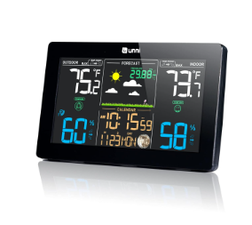
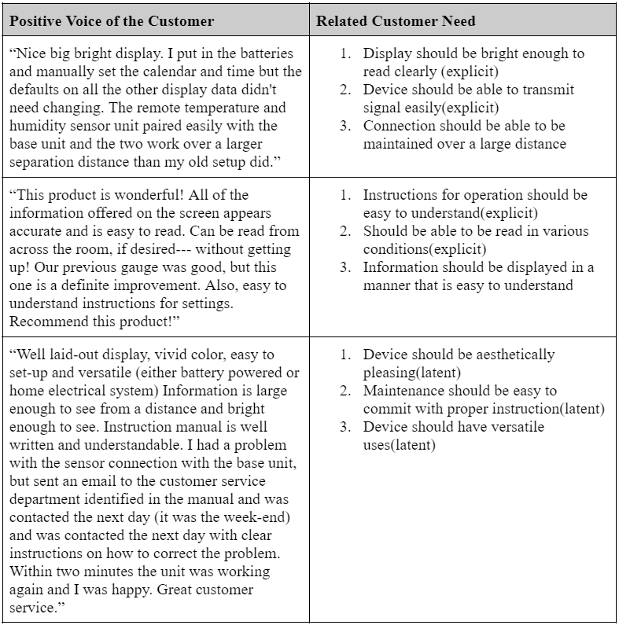
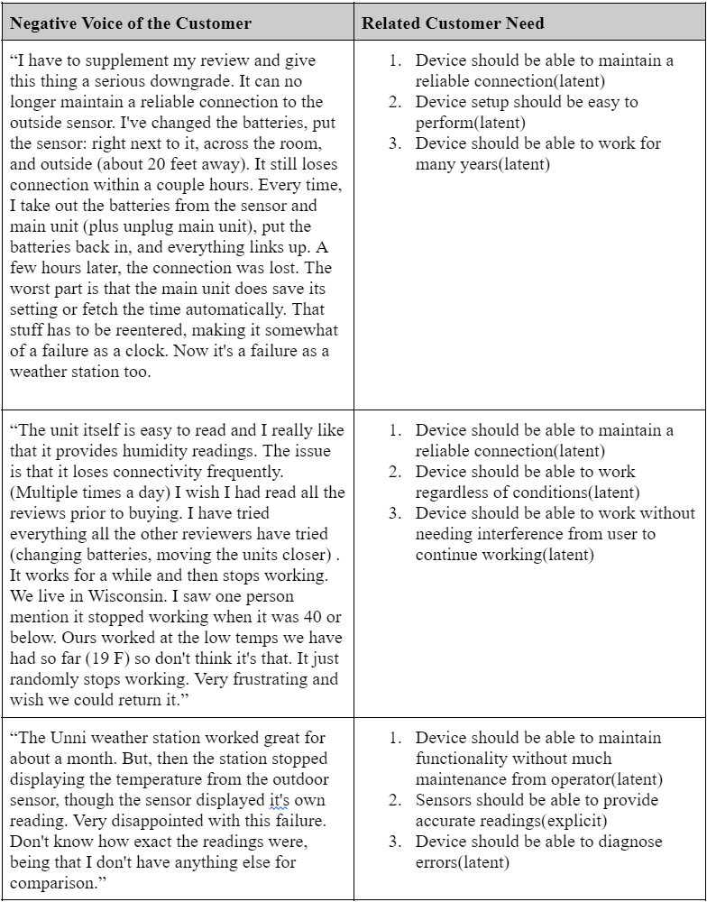
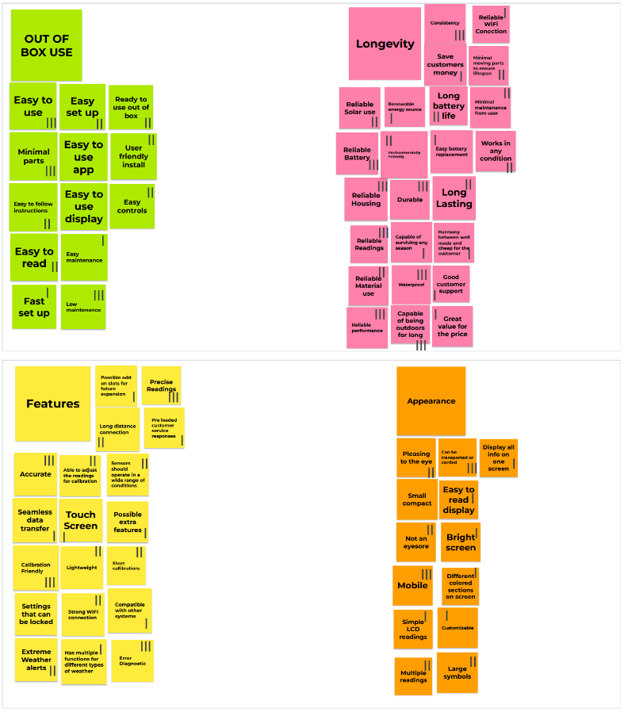

# Benchmarking

## 1. Searched: “Mobile weather station”
 

Search Result: [Ambient Weather WS-2902](https://www.amazon.com/portable-weather-station/s?k=portable+weather+station)
 
Product 1: Ambient Weather WS-2902
 
Price: $189.99
 
Vendor: Amazon
 
Allows you to monitor your home and backyard weather conditions with brilliant, easy-to-read LCD color display. Wireless all-in-one integrated sensor array measures wind speed/direction, temperature, humidity, rainfall, UV and solar radiation.

### Reviews and User Needs

## 2. Searched: “Wind and Weather Station”
 

Search Result: [La Crosse Technology S81120-INT](https://www.amazon.com/portable-weather-station/s?k=portable+weather+station](https://www.amazon.com/portable-weather-station/s?k=portable+weather+station )
 
Product 2: La Crosse Technology S81120-INT
 
Price: $59.95
 
Vendor: Amazon
 
Description: Make planning your day a Breeze with La Crosse Technology’s new combination Wind and Weather station. Don’t be surprised by changing conditions in and outside of your home.

### Reviews and User Needs

## 3. Searched: “Portable weather station”
 

Search Result: [Ambient Weather WM-5 Handheld Weather Meter ](https://www.amazon.com/portable-weather-station/s?k=portable+weather+station)
 
Product 2: Ambient Weather WM-5 Handheld Weather Meter
 
Price: $140
 
Vendor: Amazon
 
Description: A complete weather station in the palm of your hand. Features an ergonomic design with soft carrying case and neck lanyard. Unique pocket-knife design to protect the unit when not in use. Water resistant and floats. Includes two year factory warranty

### Reviews and User Needs

## 4. Searched: “Wireless weather station”
 

Search Result: [ECOWITT Wittboy Pro Weather Station HP2564](https://www.amazon.com/s?k=wireless+weather+station&i=industrial&crid=CRJ8Y3HICIXV&sprefix=wireless+weather+station%2Cindustrial%2C124&ref=nb_sb_noss_2)
 
Product 2: ECOWITT Wittboy Pro Weather Station HP2564
 
Price: $299.99
 
Vendor: Amazon
 
Description: Description: All-in-1 Weather Station : Temperature, humidity, wind direction/speed, light and UV levels and Haptic Rainfall Sensor(More accuracy Anti-vibration design).

## 5. Searched: “Wireless weather station”
 

Search Result: [U UNNI Weather Station Wireless Indoor Outdoor Thermometer ](https://www.amazon.com/s?k=wireless+weather+station&i=industrial&crid=CRJ8Y3HICIXV&sprefix=wireless+weather+station%2Cindustrial%2C124&ref=nb_sb_noss_2)
 
Product 2: U UNNI Weather Station Wireless Indoor Outdoor Thermometer
 
Price: $33
 
Vendor: Amazon
 
【Multifunctional Weather Stations Wireless Indoor Outdoor】 Switchable C and F, Alarm Clock, 12/24-Hour Format, Indoor and Outdoor Temperature & Humidity, Moon Phase, Mold Index, Dew Point and Heat Index, Barometric Pressure, Max/Min Data. 

## User Needs

[Back to Home Page](/index.md)
