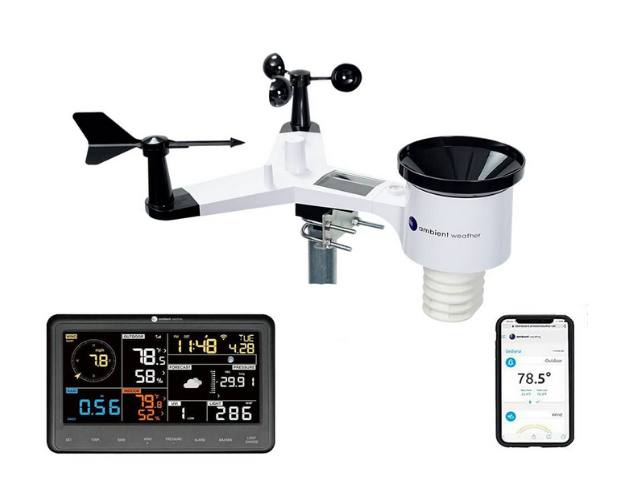

# Benchmarking

## 1. Searched: “Mobile weather station”
 

Search Result: [Ambient Weather WS-2902](https://www.amazon.com/portable-weather-station/s?k=portable+weather+station)
 
Product 1: Ambient Weather WS-2902
 
Price: $189.99
 
Vendor: Amazon
 
Allows you to monitor your home and backyard weather conditions with brilliant, easy-to-read LCD color display. Wireless all-in-one integrated sensor array measures wind speed/direction, temperature, humidity, rainfall, UV and solar radiation.

## Reviews

|Possitive|Negative|
|---|---|
|Stuart Bruce: Very simple and fast setup with easy to follow directions. Mounting was super easy and customizable LCD displays are a nice touch. (Summarization)|1.Ease of use (Explicit) 2.The kit has nice Customizability (Latent) 3.Fast setup (Latent)|

